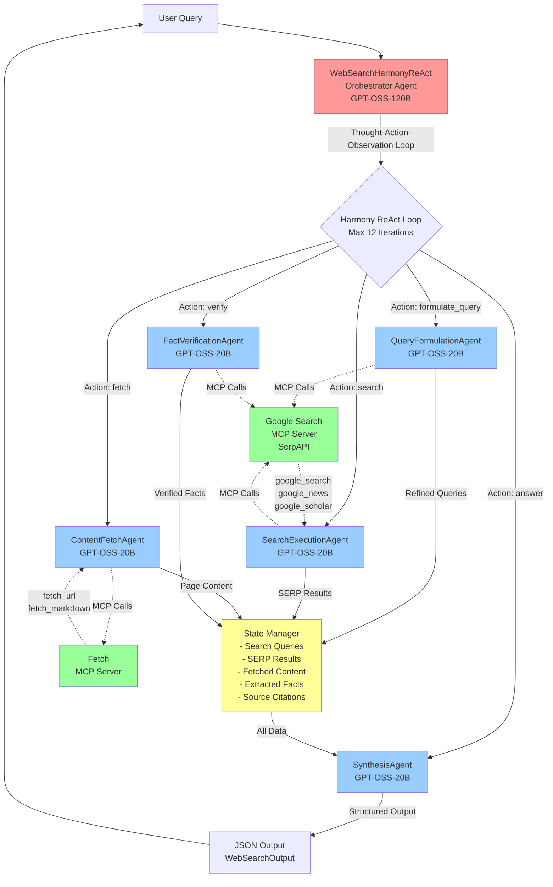
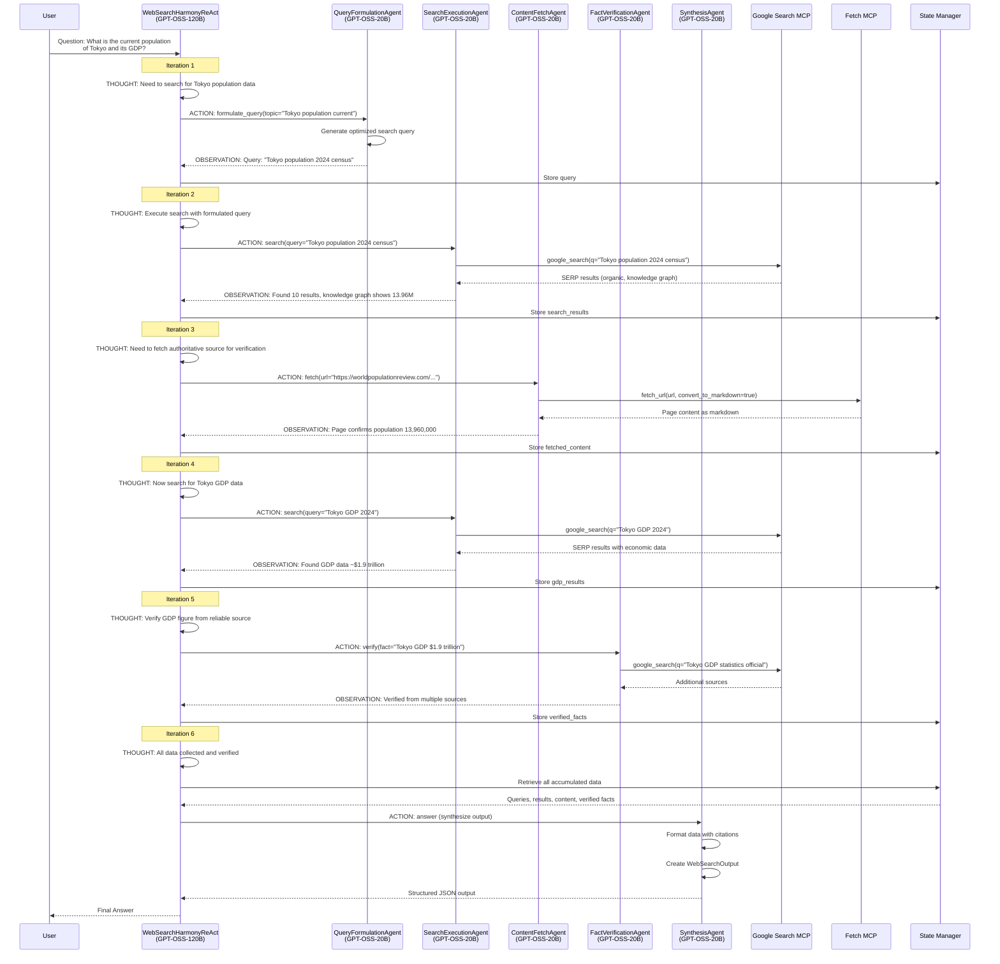
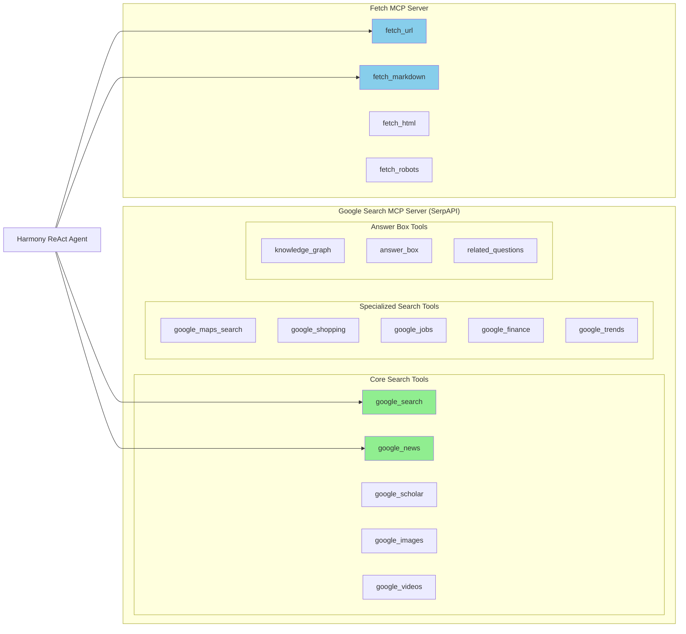
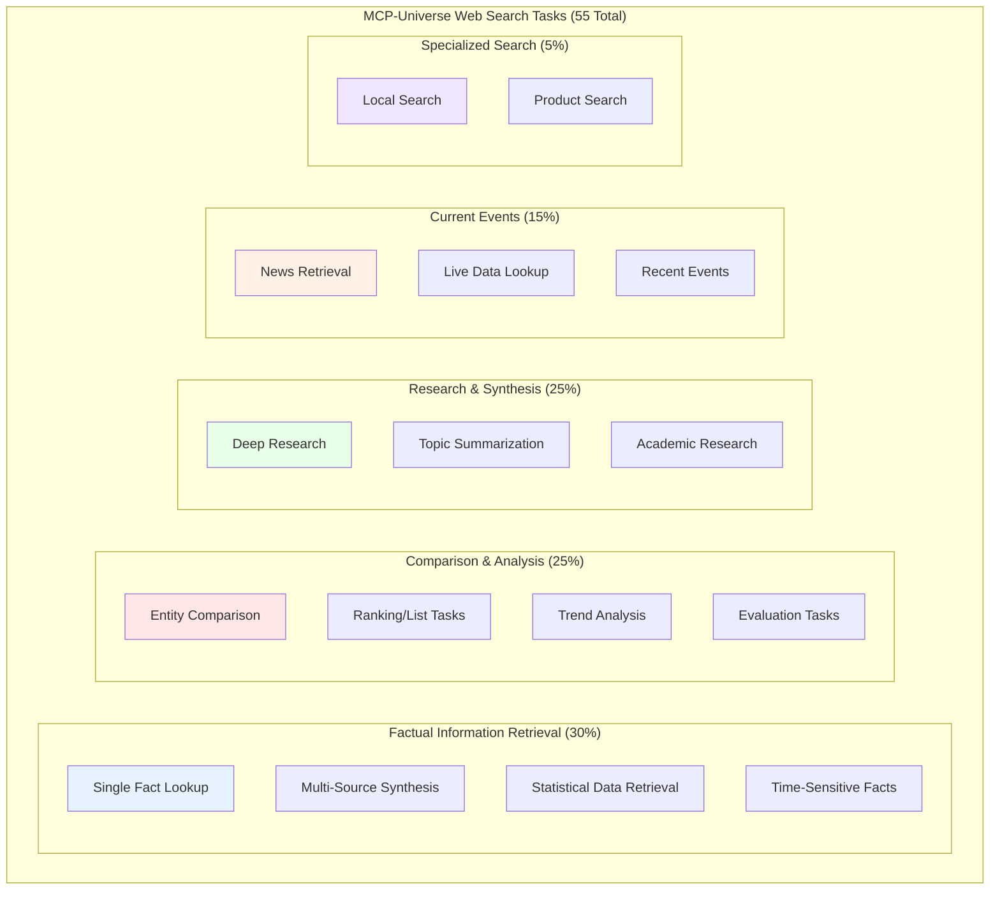
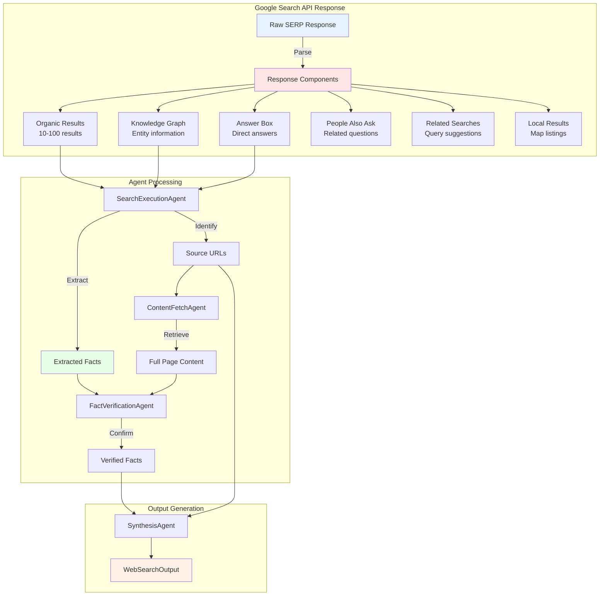

# Web Search Harmony ReAct Multi-Agent Architecture

## System Overview

The Web Search Harmony ReAct system implements a Thought-Action-Observation loop using an orchestrator-worker pattern with specialized agents for query formulation, search execution, content fetching, result synthesis, and fact verification.

This architecture document describes the complete multi-agent system built for the MCP-Universe web search benchmark using LLMs (GPT-OSS-120B for orchestration, GPT-OSS-20B for workers) integrated with Google Search MCP Server (via SerpAPI) and Fetch MCP Server.

## High-Level Architecture Diagram



## Detailed Harmony ReAct Loop Flow



## MCP Server Tool Architecture



## Component Breakdown

### 1. Orchestrator Layer

```
┌─────────────────────────────────────────────────────────────────┐
│              WebSearchHarmonyReAct (GPT-OSS-120B)                            │
│                                                                  │
│  Core Responsibilities:                                          │
│  • Parse user question and identify information needs            │
│  • Decompose complex queries into sub-questions                  │
│  • Generate THOUGHT about what search/fetch is needed            │
│  • Select ACTION type (search, fetch, verify, etc.)              │
│  • Process OBSERVATION from worker agents                        │
│  • Synthesize information from multiple sources                  │
│  • Ensure factual accuracy through cross-referencing             │
│  • Decide when sufficient information is gathered                │
│                                                                  │
│  State Tracking:                                                 │
│  • _queries: List[str] (search queries executed)                │
│  • _serp_results: Dict[query → SerpResult]                      │
│  • _fetched_content: Dict[url → PageContent]                    │
│  • _extracted_facts: List[Fact]                                 │
│  • _citations: Dict[fact → List[Source]]                        │
│  • _history: List[str] (Thought-Action-Observation entries)      │
│                                                                  │
│  Max Iterations: 12 (balanced for search + fetch cycles)        │
└─────────────────────────────────────────────────────────────────┘
```

### 2. Worker Agent Layer

```
┌─────────────────────┐  ┌─────────────────────┐  ┌─────────────────────┐
│ QueryFormulation    │  │ SearchExecution     │  │ ContentFetch        │
│     Agent           │  │     Agent           │  │     Agent           │
│  (GPT-OSS-20B)      │  │  (GPT-OSS-20B)      │  │  (GPT-OSS-20B)      │
├─────────────────────┤  ├─────────────────────┤  ├─────────────────────┤
│ • Analyze user      │  │ • Execute searches  │  │ • Fetch full page   │
│   intent            │  │ • Parse SERP data   │  │   content           │
│ • Generate optimal  │  │ • Extract organic   │  │ • Convert to        │
│   search queries    │  │   results           │  │   markdown          │
│ • Add temporal      │  │ • Process knowledge │  │ • Extract relevant  │
│   qualifiers        │  │   graph data        │  │   sections          │
│ • Handle ambiguous  │  │ • Handle answer     │  │ • Parse tables and  │
│   terms             │  │   boxes             │  │   structured data   │
│                     │  │                     │  │ • Handle rate limits│
│ No direct MCP calls │  │ MCP Tools:          │  │                     │
│ Uses LLM reasoning  │  │ • google_search     │  │ MCP Tools:          │
│                     │  │ • google_news       │  │ • fetch_url         │
│                     │  │ • google_scholar    │  │ • fetch_markdown    │
└─────────────────────┘  └─────────────────────┘  └─────────────────────┘

┌─────────────────────┐  ┌──────────────────────────────────────────────┐
│ FactVerification    │  │              SynthesisAgent                  │
│     Agent           │  │              (GPT-OSS-20B)                   │
│  (GPT-OSS-20B)      │  ├──────────────────────────────────────────────┤
├─────────────────────┤  │ • Aggregate facts from multiple sources     │
│ • Cross-reference   │  │ • Resolve conflicting information           │
│   facts across      │  │ • Generate coherent response                │
│   sources           │  │ • Add proper citations                      │
│ • Identify          │  │ • Format output according to spec           │
│   conflicting info  │  │ • Handle incomplete data gracefully         │
│ • Assess source     │  │ • Create WebSearchOutput                    │
│   credibility       │  │                                              │
│ • Flag uncertain    │  │ No direct MCP calls - processes data        │
│   claims            │  │ accumulated by other agents                 │
│                     │  │                                              │
│ MCP Tools:          │  │                                              │
│ • google_search     │  │                                              │
│   (for verification)│  │                                              │
└─────────────────────┘  └──────────────────────────────────────────────┘
```

### 3. MCP Integration Layer

```
┌─────────────────────────────────────────────────────────────────┐
│           Google Search MCP Wrapper (SerpAPI)                   │
├─────────────────────────────────────────────────────────────────┤
│                                                                  │
│  Core Search Tools:                                              │
│  • google_search(q, location, num) → Web search results         │
│  • google_news(q, location) → News articles                     │
│  • google_scholar(q) → Academic papers                          │
│  • google_images(q) → Image search results                      │
│  • google_videos(q) → Video search results                      │
│                                                                  │
│  Specialized Search Tools:                                       │
│  • google_maps_search(q, ll) → Location-based results           │
│  • google_shopping(q) → Product listings                        │
│  • google_jobs(q, location) → Job listings                      │
│  • google_finance(q) → Financial data                           │
│  • google_trends(q) → Search trend data                         │
│                                                                  │
│  Result Types Extracted:                                         │
│  • Organic Results: title, link, snippet, position              │
│  • Knowledge Graph: entity info, facts, related                 │
│  • Answer Box: direct answers, calculations                     │
│  • People Also Ask: related questions                           │
│  • Related Searches: query suggestions                          │
│                                                                  │
└─────────────────────────────────────────────────────────────────┘

┌─────────────────────────────────────────────────────────────────┐
│                   Fetch MCP Wrapper                              │
├─────────────────────────────────────────────────────────────────┤
│                                                                  │
│  Content Retrieval Tools:                                        │
│  • fetch_url(url) → Raw HTML content                            │
│  • fetch_markdown(url) → Content converted to markdown          │
│  • fetch_text(url) → Plain text extraction                      │
│  • fetch_robots(domain) → robots.txt content                    │
│                                                                  │
│  Features:                                                       │
│  • JavaScript rendering support                                  │
│  • Cookie handling                                               │
│  • User-agent rotation                                           │
│  • Rate limiting compliance                                      │
│  • Content truncation for large pages                           │
│                                                                  │
└─────────────────────────────────────────────────────────────────┘
```

### 4. State Management Layer

```
┌─────────────────────────────────────────────────────────────────┐
│                     WebSearchStateManager                        │
├─────────────────────────────────────────────────────────────────┤
│                                                                  │
│  Query History:                                                  │
│  ┌─────────────────────────────────────────────────────────┐    │
│  │  queries: [                                              │    │
│  │    "Tokyo population 2024 census",                       │    │
│  │    "Tokyo GDP 2024 statistics",                          │    │
│  │    "Tokyo metropolitan area economy"                     │    │
│  │  ]                                                       │    │
│  └─────────────────────────────────────────────────────────┘    │
│                                                                  │
│  SERP Results Cache:                                             │
│  ┌─────────────────────────────────────────────────────────┐    │
│  │  "Tokyo population 2024": {                              │    │
│  │    organic_results: [{title, link, snippet}, ...],      │    │
│  │    knowledge_graph: {population: "13.96M", ...},        │    │
│  │    answer_box: {answer: "13,960,000", source: "..."},   │    │
│  │    related_questions: ["What is Tokyo's density?", ...]  │    │
│  │  }                                                       │    │
│  └─────────────────────────────────────────────────────────┘    │
│                                                                  │
│  Fetched Content Store:                                          │
│  ┌─────────────────────────────────────────────────────────┐    │
│  │  "https://worldpopulationreview.com/tokyo": {           │    │
│  │    title: "Tokyo Population 2024",                       │    │
│  │    content: "Tokyo has a population of 13,960,000...",  │    │
│  │    fetch_time: "2025-01-15T10:30:00Z",                  │    │
│  │    content_length: 15234                                 │    │
│  │  }                                                       │    │
│  └─────────────────────────────────────────────────────────┘    │
│                                                                  │
│  Extracted Facts:                                                │
│  ┌─────────────────────────────────────────────────────────┐    │
│  │  [{                                                      │    │
│  │    fact: "Tokyo population is 13,960,000",              │    │
│  │    confidence: 0.95,                                     │    │
│  │    sources: ["worldpopulationreview.com", "wikipedia"], │    │
│  │    verified: true                                        │    │
│  │  }]                                                      │    │
│  └─────────────────────────────────────────────────────────┘    │
│                                                                  │
│  Citation Index:                                                 │
│  ┌─────────────────────────────────────────────────────────┐    │
│  │  {                                                       │    │
│  │    "population_13.96M": [                               │    │
│  │      {url: "...", title: "...", accessed: "..."}        │    │
│  │    ]                                                     │    │
│  │  }                                                       │    │
│  └─────────────────────────────────────────────────────────┘    │
│                                                                  │
└─────────────────────────────────────────────────────────────────┘
```

## Web Search Task Categories



## Data Models

```
┌─────────────────────────────────────────────────────────────────┐
│                      Data Model Definitions                      │
├─────────────────────────────────────────────────────────────────┤
│                                                                  │
│  class SearchResult(BaseModel):                                  │
│      position: int           # Ranking in SERP                   │
│      title: str              # Page title                        │
│      link: str               # URL                               │
│      snippet: str            # Text snippet                      │
│      displayed_link: str     # Display URL                       │
│      date: Optional[str]     # Publication date if available     │
│                                                                  │
│  class KnowledgeGraph(BaseModel):                                │
│      title: str              # Entity name                       │
│      entity_type: str        # Type (person, place, etc.)        │
│      description: str        # Short description                 │
│      facts: Dict[str, str]   # Key-value facts                   │
│      source: str             # Data source                       │
│                                                                  │
│  class AnswerBox(BaseModel):                                     │
│      answer: str             # Direct answer                     │
│      source: str             # Source website                    │
│      source_link: str        # Source URL                        │
│      answer_type: str        # Type: featured_snippet, calc, etc.│
│                                                                  │
│  class FetchedContent(BaseModel):                                │
│      url: str                # Source URL                        │
│      title: str              # Page title                        │
│      content: str            # Main content (markdown)           │
│      fetch_time: datetime    # When fetched                      │
│      content_type: str       # HTML, PDF, etc.                   │
│                                                                  │
│  class ExtractedFact(BaseModel):                                 │
│      statement: str          # The fact statement                │
│      value: Optional[Any]    # Numeric/structured value          │
│      unit: Optional[str]     # Unit if applicable                │
│      confidence: float       # Confidence score 0-1              │
│      sources: List[str]      # Supporting source URLs            │
│      verified: bool          # Cross-verified flag               │
│                                                                  │
│  class WebSearchOutput(BaseModel):                               │
│      query: str              # Original user query               │
│      answer: str             # Synthesized answer                │
│      facts: List[ExtractedFact]  # Extracted facts              │
│      sources: List[Dict]     # Citation list                     │
│      search_count: int       # Number of searches performed      │
│      confidence: float       # Overall confidence                │
│                                                                  │
└─────────────────────────────────────────────────────────────────┘
```

## Detailed Task Flow: Multi-Fact Research

```
═══════════════════════════════════════════════════════════════════════════════
Task: "Compare the GDP, population, and area of Tokyo vs New York City"
═══════════════════════════════════════════════════════════════════════════════

Iteration 1:
  THOUGHT: "Need to gather data for Tokyo first - starting with population"
  ACTION:  formulate_query(topic="Tokyo statistics")
  AGENT:   Generate optimized queries for each metric
  OBSERVATION: "Queries: 'Tokyo population 2024', 'Tokyo GDP 2024', 'Tokyo area km2'"
  STATE: queries = ["Tokyo population 2024", ...]

─────────────────────────────────────────────────────────────────────────────
Iteration 2:
  THOUGHT: "Execute search for Tokyo population"
  ACTION:  search(query="Tokyo population 2024")
  MCP:     google_search(q="Tokyo population 2024", num=10)
  OBSERVATION: "Knowledge Graph: 13.96M, Organic results with detailed stats"
  STATE: serp_results["Tokyo population"] = {
           knowledge_graph: {population: "13,960,000"},
           organic_results: [{title: "Tokyo Population...", ...}]
         }

─────────────────────────────────────────────────────────────────────────────
Iteration 3:
  THOUGHT: "Search for Tokyo GDP"
  ACTION:  search(query="Tokyo GDP 2024 trillion")
  MCP:     google_search(q="Tokyo GDP 2024 trillion", num=10)
  OBSERVATION: "Found GDP approximately $1.9 trillion (metro area)"
  STATE: serp_results["Tokyo GDP"] = {...}

─────────────────────────────────────────────────────────────────────────────
Iteration 4:
  THOUGHT: "Search for Tokyo area"
  ACTION:  search(query="Tokyo total area square kilometers")
  MCP:     google_search(q="Tokyo total area square kilometers", num=10)
  OBSERVATION: "Area: 2,194 km² (city proper), 13,452 km² (metro)"
  STATE: serp_results["Tokyo area"] = {...}

─────────────────────────────────────────────────────────────────────────────
Iteration 5:
  THOUGHT: "Now gather same data for New York City"
  ACTION:  search(query="New York City population 2024")
  MCP:     google_search(q="New York City population 2024", num=10)
  OBSERVATION: "NYC population: 8.34 million"
  STATE: serp_results["NYC population"] = {...}

─────────────────────────────────────────────────────────────────────────────
Iteration 6:
  THOUGHT: "Search for NYC GDP"
  ACTION:  search(query="New York City GDP 2024")
  MCP:     google_search(q="New York City GDP 2024", num=10)
  OBSERVATION: "NYC GDP: ~$1.1 trillion (city), ~$2.0 trillion (metro)"
  STATE: serp_results["NYC GDP"] = {...}

─────────────────────────────────────────────────────────────────────────────
Iteration 7:
  THOUGHT: "Search for NYC area"
  ACTION:  search(query="New York City area square kilometers")
  MCP:     google_search(q="New York City area square kilometers", num=10)
  OBSERVATION: "NYC area: 783.8 km² (city), 34,490 km² (metro)"
  STATE: serp_results["NYC area"] = {...}

─────────────────────────────────────────────────────────────────────────────
Iteration 8:
  THOUGHT: "Fetch detailed source for verification"
  ACTION:  fetch(url="https://worldpopulationreview.com/world-cities")
  MCP:     fetch_markdown(url="https://worldpopulationreview.com/world-cities")
  OBSERVATION: "Detailed stats confirm Tokyo and NYC population figures"
  STATE: fetched_content["worldpopulationreview"] = {...}

─────────────────────────────────────────────────────────────────────────────
Iteration 9:
  THOUGHT: "Verify GDP figures from reliable source"
  ACTION:  verify(facts=["Tokyo GDP $1.9T", "NYC GDP $1.1T"])
  MCP:     google_search(q="world city GDP rankings 2024")
  OBSERVATION: "Multiple sources confirm GDP figures within expected range"
  STATE: verified_facts = [{fact: "...", verified: true}, ...]

─────────────────────────────────────────────────────────────────────────────
Iteration 10:
  THOUGHT: "All data collected and verified, synthesize comparison"
  ACTION:  answer
  SYNTHESIS: Create comparison table with all metrics
  OUTPUT: {
    "comparison": {
      "Tokyo": {
        "population": "13,960,000",
        "gdp": "$1.9 trillion (metro)",
        "area": "2,194 km² (city) / 13,452 km² (metro)"
      },
      "New York City": {
        "population": "8,340,000",
        "gdp": "$1.1 trillion (city) / $2.0 trillion (metro)",
        "area": "783.8 km² (city) / 34,490 km² (metro)"
      }
    },
    "analysis": "Tokyo has larger population but NYC has larger metro GDP...",
    "sources": ["worldpopulationreview.com", "statista.com", "..."]
  }
═══════════════════════════════════════════════════════════════════════════════
```

## Detailed Task Flow: Current Events Research

```
═══════════════════════════════════════════════════════════════════════════════
Task: "What are the latest developments in AI regulation in the EU?"
═══════════════════════════════════════════════════════════════════════════════

Iteration 1:
  THOUGHT: "Need recent news about EU AI regulation"
  ACTION:  search(query="EU AI Act regulation 2024 latest", search_type="news")
  MCP:     google_news(q="EU AI Act regulation 2024 latest")
  OBSERVATION: "Found 10 recent news articles about EU AI Act"
  STATE: news_results = [{title: "EU AI Act enters force...", date: "2024-08-01"}]

─────────────────────────────────────────────────────────────────────────────
Iteration 2:
  THOUGHT: "Fetch the most relevant article for details"
  ACTION:  fetch(url="https://ec.europa.eu/ai-act-news...")
  MCP:     fetch_markdown(url="...")
  OBSERVATION: "Article details AI Act provisions, timeline, penalties"
  STATE: fetched_content["eu_official"] = {content: "The EU AI Act..."}

─────────────────────────────────────────────────────────────────────────────
Iteration 3:
  THOUGHT: "Search for specific provisions and timeline"
  ACTION:  search(query="EU AI Act timeline implementation 2024 2025")
  MCP:     google_search(q="EU AI Act timeline implementation 2024 2025")
  OBSERVATION: "Timeline: Aug 2024 - entry into force, Feb 2025 - prohibitions"
  STATE: serp_results["timeline"] = {...}

─────────────────────────────────────────────────────────────────────────────
Iteration 4:
  THOUGHT: "Get information about high-risk AI systems classification"
  ACTION:  search(query="EU AI Act high-risk AI systems requirements")
  MCP:     google_search(q="EU AI Act high-risk AI systems requirements")
  OBSERVATION: "High-risk systems include: employment, education, law enforcement"
  STATE: serp_results["high_risk"] = {...}

─────────────────────────────────────────────────────────────────────────────
Iteration 5:
  THOUGHT: "Verify key dates and provisions"
  ACTION:  verify(facts=["AI Act entered force Aug 2024", "Penalties up to 35M EUR"])
  MCP:     google_search(q="EU AI Act penalties fines official")
  OBSERVATION: "Confirmed: fines up to 35M EUR or 7% of global turnover"
  STATE: verified_facts = [...]

─────────────────────────────────────────────────────────────────────────────
Iteration 6:
  THOUGHT: "Sufficient information gathered, synthesize answer"
  ACTION:  answer
  SYNTHESIS: Compile recent developments with dates and sources
  OUTPUT: {
    "topic": "EU AI Regulation Developments",
    "key_developments": [
      {
        "event": "EU AI Act enters into force",
        "date": "August 1, 2024",
        "details": "World's first comprehensive AI regulation..."
      },
      {
        "event": "Prohibited AI practices ban begins",
        "date": "February 2025",
        "details": "Social scoring, manipulative AI banned..."
      }
    ],
    "key_provisions": [...],
    "sources": ["ec.europa.eu", "reuters.com", "..."],
    "last_updated": "2025-01-15"
  }
═══════════════════════════════════════════════════════════════════════════════
```

## SERP Result Processing



## SERP Response Example

```
┌─────────────────────────────────────────────────────────────────────────────┐
│                    SERP Response Structure Example                           │
├─────────────────────────────────────────────────────────────────────────────┤
│                                                                              │
│  Query: "Tokyo population 2024"                                              │
│                                                                              │
│  ┌─────────────────────────────────────────────────────────────────────┐    │
│  │  knowledge_graph: {                                                  │    │
│  │    title: "Tokyo",                                                   │    │
│  │    type: "Capital of Japan",                                         │    │
│  │    description: "Tokyo is the capital of Japan...",                 │    │
│  │    facts: {                                                          │    │
│  │      "Population": "13,960,000 (2024)",                             │    │
│  │      "Area": "2,194 km²",                                           │    │
│  │      "Mayor": "Yuriko Koike",                                       │    │
│  │      "Country": "Japan"                                              │    │
│  │    },                                                                │    │
│  │    source: "Wikipedia"                                               │    │
│  │  }                                                                   │    │
│  └─────────────────────────────────────────────────────────────────────┘    │
│                                                                              │
│  ┌─────────────────────────────────────────────────────────────────────┐    │
│  │  answer_box: {                                                       │    │
│  │    type: "featured_snippet",                                         │    │
│  │    answer: "The population of Tokyo is approximately 13.96 million", │    │
│  │    source: "World Population Review",                                │    │
│  │    link: "https://worldpopulationreview.com/world-cities/tokyo"     │    │
│  │  }                                                                   │    │
│  └─────────────────────────────────────────────────────────────────────┘    │
│                                                                              │
│  ┌─────────────────────────────────────────────────────────────────────┐    │
│  │  organic_results: [                                                  │    │
│  │    {                                                                 │    │
│  │      position: 1,                                                    │    │
│  │      title: "Tokyo Population 2024 - World Population Review",       │    │
│  │      link: "https://worldpopulationreview.com/world-cities/tokyo",  │    │
│  │      snippet: "Tokyo has a population of 13,960,000 people in 2024" │    │
│  │    },                                                                │    │
│  │    {                                                                 │    │
│  │      position: 2,                                                    │    │
│  │      title: "Population of Tokyo - Wikipedia",                       │    │
│  │      link: "https://en.wikipedia.org/wiki/Tokyo",                   │    │
│  │      snippet: "Greater Tokyo Area has over 37 million residents..." │    │
│  │    },                                                                │    │
│  │    ...                                                               │    │
│  │  ]                                                                   │    │
│  └─────────────────────────────────────────────────────────────────────┘    │
│                                                                              │
│  ┌─────────────────────────────────────────────────────────────────────┐    │
│  │  people_also_ask: [                                                  │    │
│  │    "What is Tokyo's population density?",                           │    │
│  │    "Is Tokyo the largest city in the world?",                       │    │
│  │    "What is Greater Tokyo Area population?",                        │    │
│  │    "How fast is Tokyo's population growing?"                        │    │
│  │  ]                                                                   │    │
│  └─────────────────────────────────────────────────────────────────────┘    │
│                                                                              │
│  ┌─────────────────────────────────────────────────────────────────────┐    │
│  │  related_searches: [                                                 │    │
│  │    "tokyo population 2024 metro area",                              │    │
│  │    "tokyo population growth rate",                                   │    │
│  │    "japan population 2024",                                          │    │
│  │    "tokyo vs new york population"                                    │    │
│  │  ]                                                                   │    │
│  └─────────────────────────────────────────────────────────────────────┘    │
│                                                                              │
└─────────────────────────────────────────────────────────────────────────────┘

Agent extracts:
  • Primary fact: "Tokyo population 13,960,000" (from knowledge_graph)
  • Verification source: worldpopulationreview.com (from organic_results[0])
  • Related queries: For follow-up if needed (from people_also_ask)
```

## Error Handling Strategy

```
┌─────────────────────────────────────────────────────────────────┐
│                    Error Recovery Flow                          │
└─────────────────────────────────────────────────────────────────┘

1. No Relevant Results Found:
   → Reformulate query with different keywords
   → Try more specific or more general query
   → Use alternative search type (news, scholar)
   → Report if genuinely no information available

2. API Rate Limit Exceeded:
   → Implement exponential backoff
   → Cache results to reduce API calls
   → Prioritize most important queries
   → Use cached results when available

3. Conflicting Information Across Sources:
   → Fetch additional sources for verification
   → Prefer authoritative sources (.gov, .edu)
   → Note conflicting data in response
   → Provide confidence scores

4. Fetch Failed (URL inaccessible):
   → Try alternative source from SERP results
   → Use cached/archived version if available
   → Extract info from SERP snippet instead
   → Note source accessibility issues

5. Outdated Information Detected:
   → Re-search with temporal qualifiers ("2024", "current")
   → Prioritize recent results
   → Note data freshness in response
   → Flag potentially stale information

6. Ambiguous Query:
   → Ask for clarification if critical
   → Search for multiple interpretations
   → Present all relevant findings
   → Let user disambiguate

7. Knowledge Graph Missing:
   → Rely on organic results
   → Fetch top result for details
   → Synthesize from multiple sources
   → Note reduced confidence

8. Max Iterations Reached:
   → Synthesize with available data
   → Report incomplete coverage
   → Suggest follow-up queries
   → Provide partial results with caveats
```

## Key Design Decisions

### 1. Why Two-Stage Search + Fetch?

```
┌────────────────────────────────────────────────────────────────────┐
│  Search-Only                          Search + Fetch               │
├────────────────────────────────────────────────────────────────────┤
│  Limited to SERP snippets             Full page content access     │
│  ~160 chars per result                Complete article text        │
│  May miss context                     Full context available       │
│  Faster (1 API call)                  Slower but more accurate     │
│  Lower token cost                     Higher token cost            │
│  Good for simple facts                Essential for deep research  │
└────────────────────────────────────────────────────────────────────┘
```

### 2. Why Separate Query Formulation Agent?

- **Query Optimization**: Transforms natural language into effective search queries
- **Temporal Awareness**: Adds date qualifiers when freshness matters
- **Disambiguation**: Handles ambiguous terms before search
- **Multi-Query Generation**: Creates multiple queries for complex questions

### 3. Why Fact Verification Agent?

- **Cross-Referencing**: Validates facts across multiple sources
- **Conflict Detection**: Identifies contradictory information
- **Source Quality**: Assesses credibility of sources
- **Confidence Scoring**: Provides reliability metrics

### 4. Why State Manager for Web Search?

- **Query Deduplication**: Avoids redundant searches
- **Result Caching**: Stores SERP results for reference
- **Citation Tracking**: Maintains source attribution
- **Progress Tracking**: Knows what's been searched vs. needed

## Performance Characteristics

```
┌────────────────────────┬──────────────┬────────────────────┬────────────────┐
│ Task Complexity        │ Iterations   │ Execution Time     │ API Calls      │
├────────────────────────┼──────────────┼────────────────────┼────────────────┤
│ Simple Fact Lookup     │ 2-3          │ ~5-10 seconds      │ 1-2 searches   │
│ (single question)      │              │                    │ 0-1 fetches    │
├────────────────────────┼──────────────┼────────────────────┼────────────────┤
│ Multi-Fact Query       │ 4-6          │ ~15-25 seconds     │ 3-5 searches   │
│ (comparison, list)     │              │                    │ 1-2 fetches    │
├────────────────────────┼──────────────┼────────────────────┼────────────────┤
│ Deep Research          │ 8-12         │ ~45-90 seconds     │ 5-10 searches  │
│ (synthesis, analysis)  │              │                    │ 3-5 fetches    │
├────────────────────────┼──────────────┼────────────────────┼────────────────┤
│ Current Events         │ 4-7          │ ~20-40 seconds     │ 2-4 news       │
│ (news + verification)  │              │                    │ 2-3 fetches    │
└────────────────────────┴──────────────┴────────────────────┴────────────────┘

Token Usage (approximate):
• Orchestrator (GPT-OSS-120B): 1500-4000 tokens per iteration
• Workers (GPT-OSS-20B): 400-1200 tokens per call
• Total per task: 15k-50k tokens

API Costs:
• SerpAPI: ~$0.01-0.05 per search
• Fetch: Typically free (self-hosted or included)
• LLM tokens: Variable based on provider
```

## Benchmark Integration

```
┌─────────────────────────────────────────────────────────────────────────────┐
│                    MCP-Universe Benchmark Integration                        │
└─────────────────────────────────────────────────────────────────────────────┘

MCP-Universe Benchmark Runner
    ↓
Load web_search.yaml config file
    ↓
For each task (55 total):
  1. Load task JSON (question, output_format, evaluators)
  2. Initialize WebSearchHarmonyReAct agent
  3. Connect to Google Search MCP Server + Fetch MCP Server
  4. Call agent.execute(question, output_format)
  5. Get structured output
  6. Run evaluators:
     ┌────────────────────────────────────────────────────────────────┐
     │ Format Evaluators:                                             │
     │   - Verify JSON structure matches output_format                │
     │   - Check required fields present                              │
     │   - Validate data types                                        │
     │                                                                │
     │ Static Evaluators:                                             │
     │   - Match extracted facts against known answers                │
     │   - Verify specific values (population, dates, etc.)           │
     │   - Check completeness of multi-part answers                   │
     │                                                                │
     │ Dynamic Evaluators:                                            │
     │   - Re-search to verify current facts                          │
     │   - Check against live data sources                            │
     │   - Validate time-sensitive information                        │
     └────────────────────────────────────────────────────────────────┘
  7. Calculate accuracy score
    ↓
Generate benchmark report with scores per task category

Example Evaluator Definitions:
{
  "evaluators": [
    {
      "func": "json -> get(population)",
      "op": "within_range",
      "value": [13800000, 14100000],
      "op_args": {"tolerance": 0.02}
    },
    {
      "func": "json -> get(sources) -> len",
      "op": ">=",
      "value": 2
    },
    {
      "func": "json -> get(answer)",
      "op": "contains_all",
      "value": ["Tokyo", "million"]
    }
  ]
}
```

## Task Definition Examples

```json
// Example 1: Simple Fact Lookup
{
  "category": "web_search",
  "question": "What is the current population of Japan?",
  "mcp_servers": [
    {"name": "google-search"},
    {"name": "fetch"}
  ],
  "output_format": {
    "country": "<Country name>",
    "population": "<Population number>",
    "year": "<Data year>",
    "source": "<Source of information>"
  },
  "evaluators": [
    {
      "func": "json -> get(country)",
      "op": "=",
      "value": "Japan"
    },
    {
      "func": "json -> get(population)",
      "op": "within_range",
      "value": [123000000, 126000000]
    }
  ]
}

// Example 2: Comparison Task
{
  "category": "web_search",
  "question": "Compare the market cap of Apple, Microsoft, and Google. Which is the largest?",
  "mcp_servers": [
    {"name": "google-search"},
    {"name": "fetch"}
  ],
  "output_format": {
    "companies": [
      {
        "name": "<Company name>",
        "market_cap": "<Market cap in USD>",
        "rank": "<Ranking position>"
      }
    ],
    "largest": "<Name of largest company>",
    "data_date": "<Date of data>"
  },
  "evaluators": [
    {
      "func": "json -> get(companies) -> len",
      "op": "=",
      "value": 3
    },
    {
      "func": "json -> get(largest)",
      "op": "in",
      "value": ["Apple", "Microsoft", "Google", "Alphabet"]
    }
  ]
}

// Example 3: Current Events Research
{
  "category": "web_search",
  "question": "What are the major announcements from the latest CES technology conference?",
  "mcp_servers": [
    {"name": "google-search"},
    {"name": "fetch"}
  ],
  "output_format": {
    "event": "<Event name>",
    "year": "<Event year>",
    "major_announcements": [
      {
        "company": "<Company name>",
        "announcement": "<Brief description>",
        "category": "<Tech category>"
      }
    ],
    "sources": ["<Source URLs>"]
  },
  "evaluators": [
    {
      "func": "json -> get(major_announcements) -> len",
      "op": ">=",
      "value": 3
    },
    {
      "func": "json -> get(sources) -> len",
      "op": ">=",
      "value": 2
    }
  ]
}

// Example 4: Academic Research
{
  "category": "web_search",
  "question": "Find recent research papers about transformer architecture improvements in NLP",
  "mcp_servers": [
    {"name": "google-search"},
    {"name": "fetch"}
  ],
  "output_format": {
    "topic": "<Research topic>",
    "papers": [
      {
        "title": "<Paper title>",
        "authors": "<Author names>",
        "year": "<Publication year>",
        "key_contribution": "<Main contribution>"
      }
    ],
    "trends": "<Summary of research trends>"
  },
  "evaluators": [
    {
      "func": "json -> get(papers) -> len",
      "op": ">=",
      "value": 3
    },
    {
      "func": "json -> get(papers) -> foreach -> get(year)",
      "op": "all_>=",
      "value": 2022
    }
  ]
}
```

## File Structure

```
ossmcpuniverse/
├── agents/
│   ├── base.py                              # BaseAgent class
│   ├── models.py                            # Pydantic models
│   ├── tools.py                             # MCP tool wrappers
│   ├── web_search_harmony_react.py           # Main orchestrator (400 lines)
│   ├── query_formulation_agent.py           # Query optimization worker (150 lines)
│   ├── search_execution_agent.py            # Search execution worker (200 lines)
│   ├── content_fetch_agent.py               # Content retrieval worker (180 lines)
│   ├── fact_verification_agent.py           # Fact verification worker (170 lines)
│   ├── synthesis_agent.py                   # Output synthesis worker (150 lines)
│   └── __init__.py                          # Export all classes
├── mcp/
│   ├── manager.py                           # MCPManager for server connections
│   ├── configs/
│   │   └── server_list.json                 # MCP server configurations
│   └── servers/
│       ├── google_search/                   # Google Search MCP (SerpAPI)
│       └── fetch/                           # Fetch MCP integration
├── scripts/
│   ├── test_web_search_harmony_react.py      # Standalone test script
│   └── run_benchmark.py                     # Full benchmark runner
├── benchmark/
│   ├── runner.py                            # BenchmarkRunner
│   ├── report.py                            # BenchmarkReport
│   └── configs/
│       └── test/
│           ├── web_search.yaml              # Benchmark config
│           └── web_search/                  # Task definitions
│               ├── simple_fact_lookup.json
│               ├── comparison_task.json
│               ├── current_events.json
│               ├── academic_research.json
│               └── ... (55 tasks total)
└── tracer/
    └── collectors.py                        # MemoryCollector, FileCollector
```

## Benchmark Configuration

```yaml
# web_search.yaml
kind: llm
spec:
  name: orchestrator-llm
  type: openai
  config:
    model_name: gpt-oss-120b
    temperature: 0.1

---
kind: llm
spec:
  name: worker-llm
  type: openai
  config:
    model_name: gpt-oss-20b
    temperature: 0.1

---
kind: agent
spec:
  name: web-search-harmony-react
  type: harmony-react
  config:
    orchestrator_llm: orchestrator-llm
    worker_llm: worker-llm
    instruction: |
      You are a web search agent that finds and synthesizes information
      from the internet to answer user questions. Use the Google Search
      MCP server to search and the Fetch MCP server to retrieve full
      page content when needed. Always verify facts from multiple sources
      and provide citations.
    servers:
      - name: google-search
      - name: fetch
    max_iterations: 12

---
kind: benchmark
spec:
  description: Web Search benchmark for MCP-Universe
  agent: web-search-harmony-react
  tasks:
    - web_search/simple_fact_lookup.json
    - web_search/comparison_task.json
    - web_search/current_events.json
    - web_search/academic_research.json
    - web_search/multi_source_synthesis.json
    # ... 55 tasks total
```

## Future Enhancements

1. **Query Expansion**: Automatic synonym and related term expansion
2. **Source Ranking**: ML-based source credibility scoring
3. **Caching Layer**: Redis-based result caching for repeated queries
4. **Parallel Search**: Execute multiple search queries concurrently
5. **Domain-Specific Search**: Specialized handlers for academic, news, financial
6. **Multi-Language Support**: Search and fetch in multiple languages
7. **Result Deduplication**: Remove duplicate information across sources
8. **Temporal Reasoning**: Better handling of time-sensitive queries
9. **Citation Generation**: Automatic APA/MLA citation formatting
10. **Knowledge Graph Integration**: Build local knowledge graph from searches
