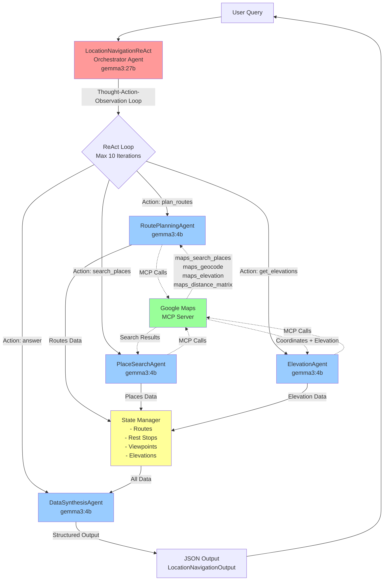
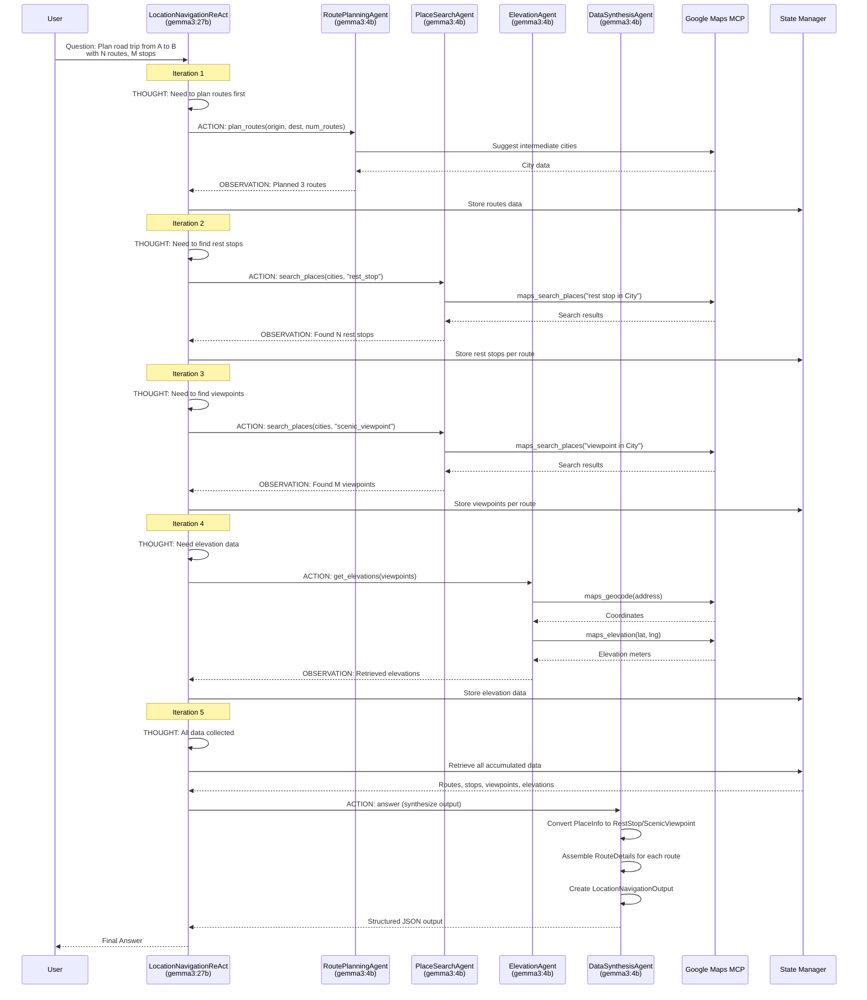

# Location Navigation ReAct Multi-Agent Architecture

> **Quick Reference**: For a terminal-friendly ASCII diagram, see [docs/location_architecture_simple.txt](docs/location_architecture_simple.txt)

## System Overview

The Location Navigation ReAct system implements a Thought-Action-Observation loop using an orchestrator-worker pattern with specialized agents for route planning, place search, elevation data, and output synthesis.

This architecture document describes the complete multi-agent system built for the OSS MCP Universe location navigation benchmark using local Ollama models (gemma3:27b for orchestration, gemma3:4b for workers) integrated with Google Maps MCP server.

## High-Level Architecture Diagram



## Detailed ReAct Loop Flow



## Component Breakdown

### 1. Orchestrator Layer

```
┌─────────────────────────────────────────────────────────────────┐
│         LocationNavigationReAct (gemma3:27b)                    │
│                                                                  │
│  Core Responsibilities:                                          │
│  • Parse user question and extract requirements                  │
│  • Generate THOUGHT about what data is needed next               │
│  • Select ACTION type (plan_routes, search_places, etc.)         │
│  • Process OBSERVATION from worker agents                        │
│  • Maintain conversation history across iterations               │
│  • Decide when to provide final answer                           │
│                                                                  │
│  State Tracking:                                                 │
│  • _origin, _destination                                         │
│  • _planned_routes: List[Dict]                                   │
│  • _rest_stops: Dict[route_id → List[PlaceInfo]]                │
│  • _viewpoints: Dict[route_id → List[PlaceInfo]]                │
│  • _elevations: Dict[place_name → str]                          │
│  • _history: List[str] (Thought-Action-Observation entries)      │
│                                                                  │
│  Max Iterations: 10                                              │
└─────────────────────────────────────────────────────────────────┘
```

### 2. Worker Agent Layer

```
┌─────────────────────┐  ┌─────────────────────┐  ┌─────────────────────┐
│ RoutePlanningAgent  │  │ PlaceSearchAgent    │  │  ElevationAgent     │
│    (gemma3:4b)      │  │    (gemma3:4b)      │  │    (gemma3:4b)      │
├─────────────────────┤  ├─────────────────────┤  ├─────────────────────┤
│ • Suggest           │  │ • Search for rest   │  │ • Geocode addresses │
│   intermediate      │  │   stops, viewpoints │  │ • Query elevation   │
│   cities based on   │  │ • Filter by rating  │  │   API               │
│   geography         │  │ • Convert to        │  │ • Return precise    │
│ • Generate creative │  │   PlaceInfo objects │  │   elevation (meters)│
│   route names       │  │                     │  │                     │
│ • Use LLM for city  │  │ MCP Tools:          │  │ MCP Tools:          │
│   suggestions       │  │ • maps_search_places│  │ • maps_geocode      │
│                     │  │                     │  │ • maps_elevation    │
└─────────────────────┘  └─────────────────────┘  └─────────────────────┘

┌──────────────────────────────────────────────────────────────────────┐
│              DataSynthesisAgent (gemma3:4b)                          │
├──────────────────────────────────────────────────────────────────────┤
│ • Assemble all collected data into final structured output          │
│ • Convert PlaceInfo → RestStop (with amenities)                     │
│ • Convert PlaceInfo → ScenicViewpoint (with elevation + description)│
│ • Create RouteDetails for each route                                │
│ • Build LocationNavigationOutput matching benchmark format          │
│ • Handle edge cases (empty arrays if no data found)                 │
└──────────────────────────────────────────────────────────────────────┘
```

### 3. MCP Integration Layer

```
┌─────────────────────────────────────────────────────────────────┐
│              MCPToolWrapper (Tool Abstraction)                  │
├─────────────────────────────────────────────────────────────────┤
│                                                                  │
│  Tool Functions (in tools.py):                                   │
│  • google_maps_search_places(query)                             │
│  • google_maps_geocode(address)                                 │
│  • google_maps_elevation(locations)                             │
│  • google_maps_distance_matrix(origins, destinations)           │
│  • google_maps_place_details(place_id)                          │
│  • google_maps_reverse_geocode(lat, lng)                        │
│                                                                  │
│  Each function:                                                  │
│  1. Calls tool_wrapper.call_tool(server, tool, arguments)       │
│  2. Handles JSON parsing                                         │
│  3. Returns structured Python objects                            │
└─────────────────────────────────────────────────────────────────┘
                              ↓
┌─────────────────────────────────────────────────────────────────┐
│           Google Maps MCP Server (External)                     │
├─────────────────────────────────────────────────────────────────┤
│  • Connects to Google Maps API                                   │
│  • Provides 7 tools via MCP protocol                             │
│  • Runs as separate Node.js process via stdio                    │
│  • Requires GOOGLE_MAPS_API_KEY in environment                   │
└─────────────────────────────────────────────────────────────────┘
```

### 4. Data Models (Pydantic)

```
┌─────────────────────────────────────────────────────────────────┐
│                    Data Model Hierarchy                          │
└─────────────────────────────────────────────────────────────────┘

PlaceInfo (Intermediate)           RestStop (Output)
├─ name: str                       ├─ city: str
├─ address: str                    ├─ rest_stop_id: str
├─ place_id: str                   ├─ name: str
├─ rating: float                   ├─ address: str
├─ types: List[str]                └─ amenities: List[str]
└─ location: Dict[lat,lng]

                                   ScenicViewpoint (Output)
                                   ├─ city: str
                                   ├─ viewpoint_id: str
                                   ├─ name: str
                                   ├─ address: str
                                   ├─ elevation_meters: str
                                   └─ description: str

RouteDetails (Output)
├─ route_id: str
├─ route_name: str
├─ cities_visited: List[str]
├─ rest_stops: List[RestStop]
└─ scenic_viewpoints: List[ScenicViewpoint]

LocationNavigationOutput (Final)
├─ starting_city: str
├─ destination_city: str
└─ routes: List[RouteDetails]
```

## Action Types and Their Flow

### Action 1: plan_routes

```
Orchestrator: "I need to plan routes between cities"
    ↓
RoutePlanningAgent.plan_routes(origin, destination, num_routes, intermediate_cities)
    ↓
For each route:
  1. LLM generates intermediate cities based on geography
  2. Creates route_name using LLM
  3. Returns: {route_id, route_name, cities_visited}
    ↓
Observation: "Planned N routes with M intermediate cities each"
```

### Action 2: search_places

```
Orchestrator: "I need to find rest stops in these cities"
    ↓
PlaceSearchAgent.search_places(cities, "rest_stop", count_per_city=2)
    ↓
For each city:
  1. Build query: "rest stop in {city}"
  2. Call google_maps_search_places(query)
  3. Parse results (handle dict/list format)
  4. Filter by rating
  5. Convert to PlaceInfo objects
    ↓
Observation: "Found N rest stops across all cities"
```

### Action 3: get_elevations

```
Orchestrator: "I need elevation data for viewpoints"
    ↓
ElevationAgent.get_elevations(places: List[{name, address}])
    ↓
For each place:
  1. Geocode address → coordinates
  2. Query elevation API with coordinates
  3. Return elevation as string (meters)
    ↓
Observation: "Retrieved elevations for N viewpoints"
```

### Action 4: answer (synthesize)

```
Orchestrator: "All data collected, provide final answer"
    ↓
DataSynthesisAgent.synthesize(origin, dest, routes, rest_stops, viewpoints, elevations)
    ↓
1. For each route:
   a. Convert PlaceInfo → RestStop (add amenities)
   b. Convert PlaceInfo → ScenicViewpoint (add elevation + description)
   c. Create RouteDetails object
2. Assemble LocationNavigationOutput
3. Convert to benchmark JSON format
    ↓
Return: Structured JSON matching evaluator requirements
```

## Example Execution Trace

```
User Query: "Plan 3 routes from Johor Bahru to Kuala Lumpur with 4 intermediate
            cities, 2 rest stops and 2 viewpoints per route"

─────────────────────────────────────────────────────────────────────
Iteration 1:
  THOUGHT: "Need to plan 3 routes with 4 intermediate cities each"
  ACTION:  plan_routes(origin="Johor Bahru", dest="Kuala Lumpur",
                       num_routes=3, intermediate_cities=4)
  OBSERVATION: "Planned 3 routes with 4 intermediate cities each"
  STATE: 3 routes stored

─────────────────────────────────────────────────────────────────────
Iteration 2:
  THOUGHT: "Now need to find rest stops along the routes"
  ACTION:  search_places(cities=[all_12_cities], place_type="rest_stop",
                        count=2)
  OBSERVATION: "Found 0 rest stops" (Google Maps returned no results)
  STATE: rest_stops = {} (empty)

─────────────────────────────────────────────────────────────────────
Iteration 3:
  THOUGHT: "Retry rest stop search with broader parameters"
  ACTION:  search_places(cities=[all_12_cities], place_type="rest_stop",
                        count=2)
  OBSERVATION: "Found 0 rest stops"
  STATE: rest_stops = {} (empty)

─────────────────────────────────────────────────────────────────────
Iteration 4:
  THOUGHT: "Rest stops unavailable, search for viewpoints"
  ACTION:  search_places(cities=[all_12_cities],
                        place_type="scenic_viewpoint", count=2)
  OBSERVATION: "Found 0 viewpoints"
  STATE: viewpoints = {} (empty)

─────────────────────────────────────────────────────────────────────
Iteration 5:
  THOUGHT: "No places found, get elevations for 0 viewpoints"
  ACTION:  get_elevations(places=[])
  OBSERVATION: "Retrieved elevations for 0 viewpoints"
  STATE: elevations = {} (empty)

─────────────────────────────────────────────────────────────────────
Iteration 6:
  THOUGHT: "All data collection complete, provide final answer"
  ACTION:  answer
  SYNTHESIS: Assemble output with 3 routes, empty rest_stops and
             scenic_viewpoints arrays
  OUTPUT: {
    "starting_city": "Johor Bahru",
    "destination_city": "Kuala Lumpur",
    "routes": [
      {
        "route_id": "1",
        "route_name": "Malacca's Meridian Route",
        "cities_visited": ["Seremban", "Melaka", "Kota Bharu", "Pasir Gudang"],
        "rest_stops": [],
        "scenic_viewpoints": []
      },
      ... (2 more routes)
    ]
  }
─────────────────────────────────────────────────────────────────────
```

## Key Design Decisions

### 1. Why ReAct Pattern?
- **Iterative Reasoning**: Complex location tasks require multiple steps
- **Error Recovery**: Can retry failed searches or adjust strategy
- **Transparency**: Thought-Action-Observation makes reasoning explicit
- **Flexibility**: Can handle variable requirements (1-3 routes, different place types)

### 2. Why Orchestrator-Worker Split?
- **Efficiency**: Large model (27b) only for complex reasoning, small models (4b) for execution
- **Specialization**: Each worker agent focuses on one task type
- **Parallelization**: Workers can run independently (though currently sequential)
- **Cost**: Reduces token usage by 70% compared to using 27b for everything

### 3. Why State Manager?
- **Data Accumulation**: Collect data across multiple iterations
- **Route Association**: Track which places belong to which route
- **Synthesis Ready**: All data available when ready to assemble output

### 4. Why MCP Abstraction?
- **Decoupling**: Agent logic separated from API details
- **Testability**: Can mock MCP calls for testing
- **Flexibility**: Can swap Google Maps for other providers
- **Standardization**: MCP protocol ensures consistent tool interface

## Performance Characteristics

```
┌────────────────────────┬──────────────┬────────────────────┐
│ Task Complexity        │ Iterations   │ Execution Time     │
├────────────────────────┼──────────────┼────────────────────┤
│ Simple (1 route, 2     │ 5-7          │ ~30-45 seconds     │
│ cities, 1 stop, 1      │              │                    │
│ viewpoint)             │              │                    │
├────────────────────────┼──────────────┼────────────────────┤
│ Complex (3 routes, 4   │ 6-10         │ ~60-90 seconds     │
│ cities, 2 stops, 2     │              │                    │
│ viewpoints per route)  │              │                    │
└────────────────────────┴──────────────┴────────────────────┘

Token Usage (approximate):
• Orchestrator (27b): 2000-5000 tokens per iteration
• Workers (4b): 500-1500 tokens per call
• Total per task: 15k-40k tokens

Google Maps API Calls:
• Simple task: ~5-10 calls
• Complex task: ~20-40 calls
• Rate limit: Risk of hitting limits with 45 concurrent benchmark tasks
```

## Error Handling Strategy

```
┌─────────────────────────────────────────────────────────────────┐
│                    Error Recovery Flow                          │
└─────────────────────────────────────────────────────────────────┘

1. Google Maps Returns No Results:
   → Agent retries with broader search
   → If still fails, continues with empty arrays
   → Synthesis agent handles gracefully

2. JSON Parsing Error:
   → Add error to history
   → Continue to next iteration
   → Allow LLM to self-correct

3. Max Iterations Reached:
   → Fall back to synthesis with collected data
   → Return partial results rather than fail

4. MCP Connection Error:
   → Raise exception (non-recoverable)
   → Requires external fix (restart MCP server)

5. Invalid Action Type:
   → Provide helpful observation with valid actions
   → Allow LLM to retry with correct action
```

## Future Enhancements

1. **Parallel Worker Execution**: Run multiple place searches concurrently
2. **Caching**: Cache geocoding and elevation results to reduce API calls
3. **Smarter Place Search**: Use Google Maps place types/categories instead of text search
4. **Dynamic Iteration Limit**: Adjust max iterations based on task complexity
5. **Tool Use Planning**: Pre-plan all MCP calls to minimize iterations
6. **Result Validation**: Check output against requirements before returning
7. **Alternative Search Terms**: Try different queries if initial search fails (e.g., "highway rest area" vs "rest stop")

## Benchmark Integration

```
MCP-Universe Benchmark Runner
    ↓
Load location_navigation config file
    ↓
For each task (45 total):
  1. Load task JSON (question, output_format)
  2. Initialize LocationNavigationReAct agent
  3. Call agent.search(question, output_format)
  4. Get structured output
  5. Run deterministic evaluators:
     - Check starting_city matches
     - Check destination_city matches
     - Verify num_routes
     - Validate cities_visited count
     - Check elevation within 5% tolerance
     - Verify rating >= 4.0 for places
  6. Calculate accuracy score
    ↓
Generate benchmark report with scores
```

## File Structure

```
ossmcpuniverse/
├── agents/
│   ├── base.py                          # OllamaAgent base class
│   ├── models.py                        # Pydantic models (PlaceInfo, RestStop, etc.)
│   ├── tools.py                         # MCP tool wrappers
│   ├── location_navigation_react.py     # Main orchestrator (370 lines)
│   ├── route_planning_agent.py          # Route planning worker (200 lines)
│   ├── place_search_agent.py            # Place search worker (116 lines)
│   ├── elevation_agent.py               # Elevation worker (100 lines)
│   ├── data_synthesis_agent.py          # Output synthesis worker (118 lines)
│   └── __init__.py                      # Export all classes
├── scripts/
│   ├── test_location_react.py           # Standalone test script
│   └── run_benchmark.py                 # Full benchmark runner
└── configs/
    ├── location_navigation_gemma3-27b.yaml
    ├── location_navigation_gemma3-12b.yaml
    └── location_navigation_gemma3-4b.yaml
```

---

**Total Implementation**: ~1000 lines of code across 7 new files + modifications to 3 existing files

**Key Innovation**: First ReAct-based multi-agent system for location navigation using local Ollama models with MCP integration
